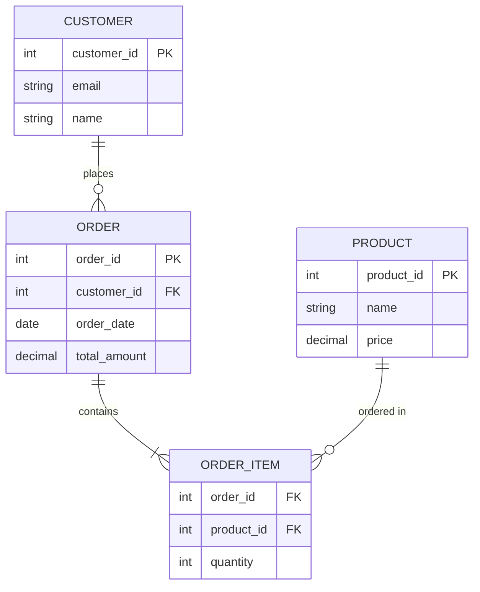

# Database Fundamentals

## 1.1 Database Design Concepts

### 1.1.1 Entity–Relationship (ER) Diagrams

An **Entity-Relationship (ER) diagram** is a visual representation of the database structure that shows entities (tables), their attributes (columns), and relationships between entities. Think of it as a blueprint for your database before writing any SQL code.

**Why ER Diagrams Matter:**
- **Communication**: Non-technical stakeholders can understand the design
- **Planning**: Identify design issues before writing code
- **Documentation**: Serves as reference for future developers
- **Normalization**: Helps spot redundancy and data integrity issues

**Real-World Analogy:**
Just like architects create blueprints before building a house, database designers create ER diagrams before building databases. You wouldn't start construction without a plan—the same applies to databases.

---

**Basic ER Diagram Components:**

**1. Entities (Rectangles)**
```
┌─────────────┐
│   Customer  │  ← Entity (becomes a table)
└─────────────┘
```

**2. Attributes (Ovals/Listed)**
```
┌─────────────┐
│   Customer  │
├─────────────┤
│ customer_id │  ← Attributes (become columns)
│ name        │
│ email       │
│ phone       │
└─────────────┘
```

**3. Primary Keys (Underlined)**
```
┌─────────────┐
│   Customer  │
├─────────────┤
│ customer_id │  ← Underlined = Primary Key
│ name        │
│ email       │
└─────────────┘
```

**4. Relationships (Diamonds/Lines)**
```
┌─────────┐         ┌───────────┐         ┌─────────┐
│Customer │─────────│  Places   │─────────│  Order  │
└─────────┘    1    └───────────┘    N    └─────────┘
              ↑                             ↑
         One customer                  Many orders
```

---

**Real-World Example: E-commerce System**

**Scenario:** Amazon-like online store with customers, orders, products, and reviews.

**ER Diagram (Text Representation):**
```
┌──────────────┐           ┌──────────────┐           ┌──────────────┐
│   Customer   │           │    Order     │           │   Product    │
├──────────────┤           ├──────────────┤           ├──────────────┤
│ customer_id  │──────────<│ order_id     │>──────────│ product_id   │
│ email        │    1:N    │ customer_id  │    N:M    │ name         │
│ name         │           │ order_date   │           │ price        │
│ address      │           │ total_amount │           │ stock_qty    │
└──────────────┘           │ status       │           └──────────────┘
                           └──────────────┘                   │
                                   │                          │
                                   │ 1:N                   1:N│
                                   │                          │
                           ┌──────────────┐                   │
                           │ Order_Items  │───────────────────┘
                           ├──────────────┤
                           │ order_id     │
                           │ product_id   │
                           │ quantity     │
                           │ unit_price   │
                           └──────────────┘
                                   │
                                1:N│
                                   │
                           ┌──────────────┐
                           │    Review    │
                           ├──────────────┤
                           │ review_id    │
                           │ product_id   │
                           │ customer_id  │
                           │ rating       │
                           │ comment      │
                           └──────────────┘
```

**Translation to SQL:**
```sql
CREATE TABLE customers (
    customer_id BIGINT AUTO_INCREMENT PRIMARY KEY,
    email VARCHAR(255) UNIQUE NOT NULL,
    name VARCHAR(100) NOT NULL,
    address TEXT
);

CREATE TABLE products (
    product_id BIGINT AUTO_INCREMENT PRIMARY KEY,
    name VARCHAR(255) NOT NULL,
    price DECIMAL(10, 2) NOT NULL,
    stock_qty INT DEFAULT 0
);

CREATE TABLE orders (
    order_id BIGINT AUTO_INCREMENT PRIMARY KEY,
    customer_id BIGINT NOT NULL,
    order_date TIMESTAMP DEFAULT CURRENT_TIMESTAMP,
    total_amount DECIMAL(10, 2),
    status VARCHAR(20) DEFAULT 'PENDING',
    FOREIGN KEY (customer_id) REFERENCES customers(customer_id)
);

CREATE TABLE order_items (
    order_id BIGINT NOT NULL,
    product_id BIGINT NOT NULL,
    quantity INT NOT NULL,
    unit_price DECIMAL(10, 2) NOT NULL,
    PRIMARY KEY (order_id, product_id),
    FOREIGN KEY (order_id) REFERENCES orders(order_id),
    FOREIGN KEY (product_id) REFERENCES products(product_id)
);

CREATE TABLE reviews (
    review_id BIGINT AUTO_INCREMENT PRIMARY KEY,
    product_id BIGINT NOT NULL,
    customer_id BIGINT NOT NULL,
    rating INT CHECK (rating BETWEEN 1 AND 5),
    comment TEXT,
    created_at TIMESTAMP DEFAULT CURRENT_TIMESTAMP,
    FOREIGN KEY (product_id) REFERENCES products(product_id),
    FOREIGN KEY (customer_id) REFERENCES customers(customer_id)
);
```

---

**ER Diagram Notations:**

**Chen Notation (Classic):**
```
┌──────┐         ┌─────────┐         ┌──────┐
│Entity│────────◇│Relation │◇────────│Entity│
└──────┘    1    └─────────┘    N    └──────┘
```

**Crow's Foot Notation (Modern, Most Common):**
```
┌──────┐         ┌──────┐
│Entity│────|<───│Entity│  (One-to-Many)
└──────┘         └──────┘

┌──────┐         ┌──────┐
│Entity│───<>───<│Entity│  (Many-to-Many)
└──────┘         └──────┘

┌──────┐         ┌──────┐
│Entity│────||───│Entity│  (One-to-One)
└──────┘         └──────┘

Crow's foot symbols:
│  = One (exactly one)
|< = Many (zero or more)
|o = Zero or one (optional)
|| = Exactly one (mandatory)
```

---

**Real-World Example: University System**

```
┌─────────────┐         ┌─────────────┐         ┌─────────────┐
│  Student    │         │ Enrollment  │         │   Course    │
├─────────────┤         ├─────────────┤         ├─────────────┤
│ student_id  │────|<───│ student_id  │───>|────│ course_id   │
│ name        │    1    │ course_id   │    N    │ course_name │
│ email       │         │ semester    │         │ credits     │
│ major       │         │ grade       │         │ department  │
└─────────────┘         └─────────────┘         └─────────────┘
       │                                                │
       │ N                                           1  │
       │                                                │
       └────────────────────>|<────────────────────────┘
                     Advised By (Self-referencing)
```

**Reading the Diagram:**
- A **student** can enroll in **many courses** (1:N from Student to Enrollment)
- A **course** can have **many students** (1:N from Course to Enrollment)
- Together: **Many-to-Many** relationship via Enrollment junction table
- Students can be advised by **one instructor** (who is also in a separate Instructors table)

---

**Common ER Diagram Patterns:**

**1. One-to-Many (1:N) - Most Common**
```
Parent: One author writes many books
Child: Each book has one author

┌────────┐         ┌────────┐
│ Author │────|<───│  Book  │
└────────┘    1:N  └────────┘
```

**2. Many-to-Many (M:N) - Requires Junction Table**
```
Students enroll in many courses
Courses have many students

┌─────────┐      ┌────────────┐      ┌────────┐
│ Student │───<>─│ Enrollment │─<>───│ Course │
└─────────┘  N   └────────────┘   N  └────────┘
```

**3. One-to-One (1:1) - Rare**
```
Each user has one profile
Each profile belongs to one user

┌──────┐         ┌─────────┐
│ User │────||───│ Profile │
└──────┘   1:1   └─────────┘
```

**4. Self-Referencing (Hierarchical)**
```
Employees can manage other employees

┌──────────┐
│ Employee │──┐
└──────────┘  │
      ↑       │
      └───────┘ manager_id references employee_id
```

---

**Real-World Example: Social Media Platform (Twitter-like)**

```
┌────────┐         ┌────────┐         ┌─────────┐
│  User  │────|<───│  Tweet │───>|────│ Hashtag │
└────────┘    1:N  └────────┘    N:M  └─────────┘
    │                  │                     ↑
    │ 1:N           1:N│                     │
    │                  │                   N:M
    │              ┌────────┐                │
    │              │  Like  │                │
    └──────>|<─────┤────────┤                │
        N          │user_id │            ┌────────────┐
                   │tweet_id│            │Tweet_Tags  │
                   └────────┘            │ (Junction) │
                       │                 └────────────┘
                       │ 1:N
                   ┌─────────┐
                   │ Comment │
                   └─────────┘
```

**Key Relationships:**
- **User → Tweet**: One-to-Many (user creates many tweets)
- **User → Like**: Many-to-Many via Like table (users like many tweets, tweets have many likes)
- **Tweet → Hashtag**: Many-to-Many via Tweet_Tags junction table
- **Tweet → Comment**: One-to-Many (tweet has many comments)

---

**ER Diagram Tools:**
- **Online**: draw.io, Lucidchart, dbdiagram.io, QuickDBD
- **Desktop**: MySQL Workbench, pgModeler, ERDPlus
- **Code**: Mermaid (text-based), PlantUML

**Mermaid Example:**


---

**Best Practices:**
1. **Name entities as nouns**: Customer, Order, Product (not CustomerTable)
2. **Name relationships as verbs**: Places, Contains, Belongs To
3. **Show cardinality clearly**: 1, N, 0..1, 1..N
4. **Include primary/foreign keys**: Mark with PK/FK notation
5. **Keep it simple**: Don't overcrowd diagram—use multiple views if needed
6. **Validate with stakeholders**: Ensure business logic is correct

### 1.1.2 Entities, Attributes, and Relationships

**Entities**, **attributes**, and **relationships** are the three fundamental building blocks of database design. Understanding these concepts is crucial for creating effective database schemas.

---

**ENTITIES**

An **entity** represents a real-world object or concept that we want to store information about. Entities become tables in the database.

**Entity Characteristics:**
- **Noun-based**: Person, place, thing, event, or concept
- **Independent existence**: Can exist on its own
- **Has attributes**: Has properties we want to track
- **Has instances**: Multiple occurrences of the same type

**Types of Entities:**

**1. Strong (Independent) Entities**
Can exist independently without depending on other entities.

```sql
-- Strong entity: Customer
CREATE TABLE customers (
    customer_id BIGINT AUTO_INCREMENT PRIMARY KEY,
    name VARCHAR(100) NOT NULL,
    email VARCHAR(255) UNIQUE NOT NULL,
    phone VARCHAR(20)
);

-- Strong entity: Product
CREATE TABLE products (
    product_id BIGINT AUTO_INCREMENT PRIMARY KEY,
    name VARCHAR(255) NOT NULL,
    price DECIMAL(10, 2),
    category VARCHAR(50)
);
```

**2. Weak (Dependent) Entities**
Cannot exist without a parent entity. Its identity depends on the parent.

```sql
-- Strong entity: Building
CREATE TABLE buildings (
    building_id INT AUTO_INCREMENT PRIMARY KEY,
    building_name VARCHAR(100),
    address TEXT
);

-- Weak entity: Room (can't exist without Building)
CREATE TABLE rooms (
    building_id INT NOT NULL,
    room_number VARCHAR(10) NOT NULL,
    capacity INT,
    room_type VARCHAR(50),
    PRIMARY KEY (building_id, room_number),  -- Composite key includes parent
    FOREIGN KEY (building_id) REFERENCES buildings(building_id) ON DELETE CASCADE
);
```

**Real-World Example: Why Room is Weak**
- "Room 305" alone is meaningless (which building?)
- "Room 305 in Building A" is specific and meaningful
- If Building A is demolished, Room 305 ceases to exist
- Identity depends on parent: (building_id, room_number)

---

**Real-World Example: Bank System**

**Strong Entities:**
```sql
-- Customers exist independently
CREATE TABLE customers (
    customer_id BIGINT AUTO_INCREMENT PRIMARY KEY,
    name VARCHAR(100),
    ssn CHAR(11) UNIQUE,
    date_of_birth DATE
);

-- Accounts exist independently (even after customer deletion, for audit)
CREATE TABLE accounts (
    account_id BIGINT AUTO_INCREMENT PRIMARY KEY,
    account_number VARCHAR(20) UNIQUE NOT NULL,
    account_type VARCHAR(20),
    balance DECIMAL(15, 2)
);
```

**Weak Entity:**
```sql
-- Beneficiaries depend on accounts (can't have beneficiary without account)
CREATE TABLE beneficiaries (
    account_id BIGINT NOT NULL,
    beneficiary_sequence INT NOT NULL,  -- 1st, 2nd, 3rd beneficiary
    name VARCHAR(100) NOT NULL,
    relationship VARCHAR(50),
    percentage DECIMAL(5, 2),
    PRIMARY KEY (account_id, beneficiary_sequence),
    FOREIGN KEY (account_id) REFERENCES accounts(account_id) ON DELETE CASCADE
);
```

---

**ATTRIBUTES**

**Attributes** are properties or characteristics of an entity. Attributes become columns in database tables.

**Types of Attributes:**

**1. Simple (Atomic) Attributes**
Cannot be divided further.

```sql
CREATE TABLE employees (
    employee_id BIGINT PRIMARY KEY,
    first_name VARCHAR(50),      -- Simple/atomic
    age INT,                     -- Simple/atomic
    salary DECIMAL(10, 2)        -- Simple/atomic
);
```

**2. Composite Attributes**
Can be divided into smaller sub-parts.

```sql
-- Composite: Address
CREATE TABLE customers (
    customer_id BIGINT PRIMARY KEY,
    -- Instead of: address VARCHAR(500)  ← Composite stored as one
    -- Break down into components:
    street_address VARCHAR(255),
    city VARCHAR(100),
    state VARCHAR(50),
    postal_code VARCHAR(20),
    country VARCHAR(50)
);

-- Composite: Name
CREATE TABLE people (
    person_id BIGINT PRIMARY KEY,
    -- Instead of: full_name VARCHAR(255)  ← Composite
    -- Break down:
    first_name VARCHAR(50),
    middle_name VARCHAR(50),
    last_name VARCHAR(50),
    suffix VARCHAR(10)  -- Jr., Sr., III
);
```

**When to Break Down Composite Attributes:**
- **Search requirements**: Need to search by city, state separately
- **Sorting**: Sort by last name, not full name
- **Validation**: Validate postal code format
- **Reporting**: Group by state, country

**3. Single-Valued Attributes**
Can have only one value per entity instance.

```sql
CREATE TABLE employees (
    employee_id BIGINT PRIMARY KEY,
    date_of_birth DATE,    -- Single value (one birthday)
    ssn CHAR(11) UNIQUE,   -- Single value (one SSN)
    salary DECIMAL(10, 2)  -- Single value (current salary)
);
```

**4. Multi-Valued Attributes**
Can have multiple values per entity instance. **Must be stored in separate table.**

```sql
-- WRONG: Storing multiple values in one column
CREATE TABLE employees (
    employee_id BIGINT PRIMARY KEY,
    phone_numbers VARCHAR(500)  -- "555-1234, 555-5678, 555-9999" ← BAD!
);

-- CORRECT: Separate table for multi-valued attribute
CREATE TABLE employees (
    employee_id BIGINT AUTO_INCREMENT PRIMARY KEY,
    name VARCHAR(100)
);

CREATE TABLE employee_phones (
    employee_id BIGINT NOT NULL,
    phone_type VARCHAR(20),  -- 'mobile', 'home', 'work'
    phone_number VARCHAR(20) NOT NULL,
    PRIMARY KEY (employee_id, phone_type),
    FOREIGN KEY (employee_id) REFERENCES employees(employee_id)
);

-- Now can store multiple phones per employee
INSERT INTO employee_phones VALUES (1, 'mobile', '555-1234');
INSERT INTO employee_phones VALUES (1, 'work', '555-5678');
INSERT INTO employee_phones VALUES (1, 'home', '555-9999');
```

**Real-World Example: Student with Multiple Emails**
```sql
CREATE TABLE students (
    student_id BIGINT PRIMARY KEY,
    name VARCHAR(100)
);

CREATE TABLE student_emails (
    student_id BIGINT NOT NULL,
    email_type VARCHAR(20),  -- 'personal', 'university', 'work'
    email_address VARCHAR(255) NOT NULL,
    is_primary BOOLEAN DEFAULT FALSE,
    PRIMARY KEY (student_id, email_type),
    FOREIGN KEY (student_id) REFERENCES students(student_id)
);
```

**5. Derived Attributes**
Values calculated from other attributes. **Don't store unless necessary for performance.**

```sql
CREATE TABLE employees (
    employee_id BIGINT PRIMARY KEY,
    date_of_birth DATE,
    hire_date DATE,
    -- age INT  ← DON'T STORE (changes daily, derived from date_of_birth)
    -- years_employed INT  ← DON'T STORE (derived from hire_date)
    salary DECIMAL(10, 2)
);

-- Calculate age on-the-fly
SELECT 
    employee_id,
    name,
    TIMESTAMPDIFF(YEAR, date_of_birth, CURDATE()) AS age
FROM employees;

-- Calculate years employed
SELECT 
    employee_id,
    name,
    TIMESTAMPDIFF(YEAR, hire_date, CURDATE()) AS years_employed
FROM employees;
```

**When to Store Derived Attributes (Denormalization for Performance):**
```sql
-- E-commerce: Calculate order total in real-time is expensive
CREATE TABLE orders (
    order_id BIGINT PRIMARY KEY,
    customer_id BIGINT,
    order_date TIMESTAMP,
    subtotal DECIMAL(10, 2),          -- Sum of item prices
    tax_amount DECIMAL(10, 2),        -- Calculated
    shipping_cost DECIMAL(10, 2),
    total_amount DECIMAL(10, 2),      -- Derived but stored for performance
    -- total_amount = subtotal + tax_amount + shipping_cost
    FOREIGN KEY (customer_id) REFERENCES customers(customer_id)
);

-- Product: Average rating (expensive to calculate from millions of reviews)
CREATE TABLE products (
    product_id BIGINT PRIMARY KEY,
    name VARCHAR(255),
    price DECIMAL(10, 2),
    avg_rating DECIMAL(3, 2),  -- Derived from reviews table, but cached
    review_count INT           -- Derived count, cached for performance
);

-- Update with trigger or background job
```

---

**RELATIONSHIPS**

**Relationships** define how entities are connected to each other. Relationships become foreign keys or junction tables.

**Types of Relationships:**

**1. One-to-One (1:1)**
One instance of Entity A relates to exactly one instance of Entity B.

**Real-World Example: User and Profile**
```sql
-- Each user has exactly one profile
-- Each profile belongs to exactly one user

CREATE TABLE users (
    user_id BIGINT AUTO_INCREMENT PRIMARY KEY,
    username VARCHAR(50) UNIQUE NOT NULL,
    email VARCHAR(255) UNIQUE NOT NULL,
    password_hash VARCHAR(255) NOT NULL
);

CREATE TABLE user_profiles (
    user_id BIGINT PRIMARY KEY,  -- Same as foreign key (enforces 1:1)
    bio TEXT,
    avatar_url VARCHAR(500),
    date_of_birth DATE,
    location VARCHAR(100),
    FOREIGN KEY (user_id) REFERENCES users(user_id) ON DELETE CASCADE
);

-- Guaranteed 1:1 because user_id is both PK and FK in user_profiles
```

**Why Separate Tables for 1:1:**
- **Optional data**: Not all users have profiles
- **Security**: Separate sensitive data (passwords) from public data (profiles)
- **Performance**: Core user table stays small and fast
- **Organization**: Logical separation of concerns

**Alternative 1:1 Implementation:**
```sql
-- Country and Capital (each country has one capital)
CREATE TABLE countries (
    country_id INT AUTO_INCREMENT PRIMARY KEY,
    country_name VARCHAR(100),
    population BIGINT
);

CREATE TABLE capitals (
    capital_id INT AUTO_INCREMENT PRIMARY KEY,
    capital_name VARCHAR(100),
    country_id INT UNIQUE NOT NULL,  -- UNIQUE enforces 1:1
    FOREIGN KEY (country_id) REFERENCES countries(country_id)
);
```

**2. One-to-Many (1:N) - Most Common**
One instance of Entity A relates to multiple instances of Entity B.

**Real-World Example: Customer and Orders**
```sql
-- One customer can place many orders
-- Each order belongs to one customer

CREATE TABLE customers (
    customer_id BIGINT AUTO_INCREMENT PRIMARY KEY,
    name VARCHAR(100),
    email VARCHAR(255) UNIQUE
);

CREATE TABLE orders (
    order_id BIGINT AUTO_INCREMENT PRIMARY KEY,
    customer_id BIGINT NOT NULL,  -- Foreign key to parent
    order_date TIMESTAMP DEFAULT CURRENT_TIMESTAMP,
    total_amount DECIMAL(10, 2),
    FOREIGN KEY (customer_id) REFERENCES customers(customer_id)
);

-- Relationship:
-- Customer 1 → Orders: 1, 5, 12, 87  (one customer, many orders)
-- Order 5 → Customer: 1  (each order belongs to one customer)
```

**More 1:N Examples:**
```sql
-- Blog: One author writes many posts
CREATE TABLE authors (
    author_id BIGINT PRIMARY KEY,
    name VARCHAR(100)
);

CREATE TABLE posts (
    post_id BIGINT PRIMARY KEY,
    author_id BIGINT NOT NULL,
    title VARCHAR(255),
    content TEXT,
    FOREIGN KEY (author_id) REFERENCES authors(author_id)
);

-- University: One department has many courses
CREATE TABLE departments (
    dept_id INT PRIMARY KEY,
    dept_name VARCHAR(100)
);

CREATE TABLE courses (
    course_id INT PRIMARY KEY,
    dept_id INT NOT NULL,
    course_name VARCHAR(255),
    credits INT,
    FOREIGN KEY (dept_id) REFERENCES departments(dept_id)
);
```

**3. Many-to-Many (M:N)**
Multiple instances of Entity A relate to multiple instances of Entity B. **Requires junction/bridge table.**

**Real-World Example: Students and Courses**
```sql
-- One student enrolls in many courses
-- One course has many students enrolled

CREATE TABLE students (
    student_id BIGINT AUTO_INCREMENT PRIMARY KEY,
    name VARCHAR(100),
    email VARCHAR(255)
);

CREATE TABLE courses (
    course_id INT AUTO_INCREMENT PRIMARY KEY,
    course_code VARCHAR(10),
    course_name VARCHAR(255)
);

-- Junction table
CREATE TABLE enrollments (
    student_id BIGINT NOT NULL,
    course_id INT NOT NULL,
    semester VARCHAR(10),
    grade CHAR(2),
    enrollment_date DATE,
    PRIMARY KEY (student_id, course_id, semester),
    FOREIGN KEY (student_id) REFERENCES students(student_id),
    FOREIGN KEY (course_id) REFERENCES courses(course_id)
);

-- Relationship:
-- Student 1 ↔ Courses: 101, 102, 201  (enrolled in 3 courses)
-- Course 101 ↔ Students: 1, 5, 12, 87  (has 4 students)
```

**More M:N Examples:**
```sql
-- Movies and Actors
CREATE TABLE movies (
    movie_id BIGINT PRIMARY KEY,
    title VARCHAR(255)
);

CREATE TABLE actors (
    actor_id BIGINT PRIMARY KEY,
    name VARCHAR(100)
);

CREATE TABLE movie_cast (
    movie_id BIGINT,
    actor_id BIGINT,
    role_name VARCHAR(100),
    billing_order INT,
    PRIMARY KEY (movie_id, actor_id),
    FOREIGN KEY (movie_id) REFERENCES movies(movie_id),
    FOREIGN KEY (actor_id) REFERENCES actors(actor_id)
);

-- Products and Tags (e-commerce)
CREATE TABLE products (
    product_id BIGINT PRIMARY KEY,
    name VARCHAR(255)
);

CREATE TABLE tags (
    tag_id INT PRIMARY KEY,
    tag_name VARCHAR(50)
);

CREATE TABLE product_tags (
    product_id BIGINT,
    tag_id INT,
    PRIMARY KEY (product_id, tag_id),
    FOREIGN KEY (product_id) REFERENCES products(product_id),
    FOREIGN KEY (tag_id) REFERENCES tags(tag_id)
);
```

**4. Self-Referencing (Recursive) Relationships**
Entity relates to itself.

**Real-World Example: Employee Management Hierarchy**
```sql
CREATE TABLE employees (
    employee_id BIGINT AUTO_INCREMENT PRIMARY KEY,
    name VARCHAR(100),
    manager_id BIGINT NULL,  -- References same table
    FOREIGN KEY (manager_id) REFERENCES employees(employee_id)
);

-- Data:
-- 1, 'CEO', NULL
-- 2, 'CTO', 1        (reports to CEO)
-- 3, 'Manager', 2    (reports to CTO)
-- 4, 'Engineer', 3   (reports to Manager)
```

**More Self-Referencing Examples:**
```sql
-- Social Media: Users follow users
CREATE TABLE users (
    user_id BIGINT PRIMARY KEY,
    username VARCHAR(50)
);

CREATE TABLE follows (
    follower_id BIGINT,
    following_id BIGINT,
    followed_at TIMESTAMP DEFAULT CURRENT_TIMESTAMP,
    PRIMARY KEY (follower_id, following_id),
    FOREIGN KEY (follower_id) REFERENCES users(user_id),
    FOREIGN KEY (following_id) REFERENCES users(user_id),
    CHECK (follower_id != following_id)  -- Can't follow yourself
);

-- File System: Folders contain folders
CREATE TABLE folders (
    folder_id BIGINT PRIMARY KEY,
    folder_name VARCHAR(255),
    parent_folder_id BIGINT NULL,
    FOREIGN KEY (parent_folder_id) REFERENCES folders(folder_id)
);
```

---

**Relationship Attributes**

Sometimes relationships themselves have attributes (properties that belong to the relationship, not either entity).

**Example: Student-Course Enrollment**
```sql
CREATE TABLE enrollments (
    student_id BIGINT,
    course_id INT,
    semester VARCHAR(10),
    grade CHAR(2),              -- Attribute of the relationship
    enrollment_date DATE,        -- Attribute of the relationship
    attendance_percentage DECIMAL(5, 2),  -- Attribute of the relationship
    PRIMARY KEY (student_id, course_id, semester),
    FOREIGN KEY (student_id) REFERENCES students(student_id),
    FOREIGN KEY (course_id) REFERENCES courses(course_id)
);
```

**Why These Belong to the Relationship:**
- `grade`: Not a student property (varies by course), not a course property (varies by student)
- `enrollment_date`: When this specific student enrolled in this specific course
- `attendance_percentage`: For this student in this course

---

**Summary Table:**

| Concept | Definition | Implementation | Example |
|---------|------------|----------------|---------|
| **Strong Entity** | Independent existence | Table with own PK | Customer, Product |
| **Weak Entity** | Depends on parent | Composite PK includes parent FK | Room (needs Building) |
| **Simple Attribute** | Atomic, indivisible | Single column | age, price |
| **Composite Attribute** | Divisible into parts | Multiple columns | address → street, city, state |
| **Multi-Valued Attribute** | Multiple values possible | Separate table | phone numbers, emails |
| **Derived Attribute** | Calculated from others | Computed (not usually stored) | age from date_of_birth |
| **1:1 Relationship** | One ↔ One | FK with UNIQUE | User ↔ Profile |
| **1:N Relationship** | One ↔ Many | FK in child table | Customer ↔ Orders |
| **M:N Relationship** | Many ↔ Many | Junction table | Students ↔ Courses |
| **Self-Referencing** | Entity relates to itself | FK references same table | Employee ↔ Manager |

### 1.1.3 Cardinality and Participation Constraints

**Cardinality** and **participation constraints** define the rules about how many instances of one entity can relate to instances of another entity, and whether participation in the relationship is optional or mandatory.

---

**CARDINALITY**

**Cardinality** specifies the numerical relationship between entity instances. It answers: "How many of Entity A can relate to how many of Entity B?"

**Cardinality Types:**

**1. One-to-One (1:1)**
```
One A ↔ One B

Example: One person has one passport
         One passport belongs to one person
```

**2. One-to-Many (1:N or 1:M)**
```
One A ↔ Many B

Example: One customer places many orders
         Each order belongs to one customer
```

**3. Many-to-One (N:1 or M:1)**
```
Many A ↔ One B

Example: Many employees work in one department
         One department has many employees

(This is the same as One-to-Many, just viewed from the other direction)
```

**4. Many-to-Many (M:N or M:M)**
```
Many A ↔ Many B

Example: Many students enroll in many courses
         Many courses have many students
```

---

**Cardinality Notation in ER Diagrams:**

**Crow's Foot Notation (Most Common):**
```
│   = One (exactly one)
|<  = Many (zero or more)
|o  = Zero or one (optional)
||  = Exactly one (mandatory one)
```

**Examples:**
```
1:1 Relationship
┌──────┐         ┌─────────┐
│ User │────||───|| Profile │
└──────┘         └─────────┘
  (Each user has exactly one profile, each profile belongs to exactly one user)

1:N Relationship  
┌──────────┐         ┌───────┐
│ Customer │────||───|< Order │
└──────────┘    1    └───────┘
  (One customer, many orders; each order belongs to one customer)

M:N Relationship
┌─────────┐         ┌────────────┐         ┌────────┐
│ Student │───|<────│ Enrollment │────<|───│ Course │
└─────────┘    N    └────────────┘    N    └────────┘
  (Many students enroll in many courses)
```

---

**PARTICIPATION CONSTRAINTS**

**Participation constraints** (also called **minimum cardinality**) specify whether an entity's participation in a relationship is mandatory or optional.

**Types:**

**1. Total (Mandatory) Participation**
Every instance of the entity **must** participate in the relationship.
- **Notation**: Double line `||` or `═` in ER diagrams
- **Minimum cardinality**: 1

**2. Partial (Optional) Participation**
Entity instances **may or may not** participate in the relationship.
- **Notation**: Single line or `o` in ER diagrams  
- **Minimum cardinality**: 0

---

**Real-World Example 1: Employee-Department**

```
┌──────────┐         ┌────────────┐
│ Employee │────||───|< Department │
└──────────┘   must  └────────────┘
               work       can
               in one     have many
```

**Business Rules:**
- **Employee → Department**: **Mandatory** (every employee MUST be assigned to a department)
- **Department → Employee**: **Optional** (a department can exist with zero employees - newly created dept)

**SQL Implementation:**
```sql
CREATE TABLE departments (
    dept_id INT AUTO_INCREMENT PRIMARY KEY,
    dept_name VARCHAR(100) NOT NULL
);

CREATE TABLE employees (
    employee_id BIGINT AUTO_INCREMENT PRIMARY KEY,
    name VARCHAR(100) NOT NULL,
    dept_id INT NOT NULL,  -- NOT NULL enforces mandatory participation
    hire_date DATE,
    FOREIGN KEY (dept_id) REFERENCES departments(dept_id)
);

-- Every employee MUST have a dept_id (can't be NULL)
-- A department can exist with no employees
```

**Validation:**
```sql
-- This succeeds: department with no employees
INSERT INTO departments (dept_name) VALUES ('New Department');

-- This fails: employee without department
INSERT INTO employees (name, dept_id) VALUES ('John Doe', NULL);
-- ERROR: dept_id cannot be NULL
```

---

**Real-World Example 2: Order-Payment**

```
┌───────┐         ┌─────────┐
│ Order │────o|───|| Payment │
└───────┘  can    └─────────┘
           have      must
           one       belong
                     to one
```

**Business Rules:**
- **Order → Payment**: **Optional** (order can exist without payment yet - pending orders)
- **Payment → Order**: **Mandatory** (payment must be associated with an order)

**SQL Implementation:**
```sql
CREATE TABLE orders (
    order_id BIGINT AUTO_INCREMENT PRIMARY KEY,
    customer_id BIGINT NOT NULL,
    order_date TIMESTAMP DEFAULT CURRENT_TIMESTAMP,
    status VARCHAR(20) DEFAULT 'PENDING',
    total_amount DECIMAL(10, 2)
);

CREATE TABLE payments (
    payment_id BIGINT AUTO_INCREMENT PRIMARY KEY,
    order_id BIGINT NOT NULL,  -- NOT NULL: payment MUST belong to order
    payment_date TIMESTAMP DEFAULT CURRENT_TIMESTAMP,
    amount DECIMAL(10, 2) NOT NULL,
    payment_method VARCHAR(20),
    FOREIGN KEY (order_id) REFERENCES orders(order_id)
);

-- Order can exist without payment (PENDING status)
-- Payment cannot exist without order (order_id NOT NULL)
```

**Scenario:**
```sql
-- Create order without payment (valid - pending payment)
INSERT INTO orders (customer_id, total_amount, status)
VALUES (101, 99.99, 'PENDING');
-- order_id = 1, no payment yet

-- Try to create payment without order (invalid)
INSERT INTO payments (order_id, amount, payment_method)
VALUES (NULL, 99.99, 'CREDIT_CARD');
-- ERROR: order_id cannot be NULL

-- Create payment for existing order (valid)
INSERT INTO payments (order_id, amount, payment_method)
VALUES (1, 99.99, 'CREDIT_CARD');
-- ✓ Success
```

---

**Cardinality Ratios with Min/Max Notation:**

Format: `(min, max)` where:
- **min**: minimum number of instances (participation constraint)
- **max**: maximum number of instances (cardinality)

**Examples:**

**1. Employee-Department (Each employee in exactly 1 department)**
```
Employee (1,1) ────── (0,N) Department

Employee side: (1,1) = mandatory, exactly one department
Department side: (0,N) = optional, zero or more employees
```

**2. Customer-Order (Customers can have 0 or more orders)**
```
Customer (1,1) ────── (0,N) Order

Customer side: Each order belongs to exactly one customer
Order side: Customer can have zero or many orders
```

**3. Person-Driver's License (Not everyone has a license)**
```
Person (0,1) ────── (1,1) License

Person side: (0,1) = optional, at most one license
License side: (1,1) = mandatory, exactly one person
```

---

**Real-World Example 3: University Course Prerequisites**

```
┌────────┐         ┌──────────────┐
│ Course │──(0,N)──│ Prerequisite │──(0,N)──┐
└────────┘         └──────────────┘         │
    ↑                                       │
    └───────────────────────────────────────┘
    
Self-referencing M:N relationship
```

**Business Rules:**
- A course can have **0 to many** prerequisites (intro courses have none)
- A course can be a prerequisite for **0 to many** other courses

**SQL Implementation:**
```sql
CREATE TABLE courses (
    course_id INT AUTO_INCREMENT PRIMARY KEY,
    course_code VARCHAR(10) UNIQUE NOT NULL,
    course_name VARCHAR(255) NOT NULL,
    credits INT
);

CREATE TABLE prerequisites (
    course_id INT NOT NULL,           -- The course
    prerequisite_course_id INT NOT NULL,  -- Required course
    PRIMARY KEY (course_id, prerequisite_course_id),
    FOREIGN KEY (course_id) REFERENCES courses(course_id),
    FOREIGN KEY (prerequisite_course_id) REFERENCES courses(course_id),
    CHECK (course_id != prerequisite_course_id)  -- Course can't be its own prereq
);

-- Example data:
-- CS101: Intro (no prerequisites)
-- CS201: Data Structures (requires CS101)
-- CS301: Algorithms (requires CS201)
-- CS401: Advanced Algorithms (requires CS301, CS250)

INSERT INTO courses VALUES (101, 'CS101', 'Intro to Programming', 3);
INSERT INTO courses VALUES (201, 'CS201', 'Data Structures', 4);
INSERT INTO courses VALUES (301, 'CS301', 'Algorithms', 4);

-- CS201 requires CS101
INSERT INTO prerequisites VALUES (201, 101);

-- CS301 requires CS201
INSERT INTO prerequisites VALUES (301, 201);
```

---

**Real-World Example 4: Hospital Patients and Doctors**

```
┌─────────┐         ┌──────────┐         ┌────────┐
│ Patient │──(1,N)──│Treatment │──(1,N)──│ Doctor │
└─────────┘         └──────────┘         └────────┘

M:N with participation constraints:
- Each patient must have at least 1 doctor (mandatory)
- Each doctor must have at least 1 patient (otherwise unemployed)
- Both can have many
```

**SQL Implementation:**
```sql
CREATE TABLE patients (
    patient_id BIGINT AUTO_INCREMENT PRIMARY KEY,
    name VARCHAR(100) NOT NULL,
    date_of_birth DATE,
    medical_record_number VARCHAR(20) UNIQUE NOT NULL
);

CREATE TABLE doctors (
    doctor_id BIGINT AUTO_INCREMENT PRIMARY KEY,
    name VARCHAR(100) NOT NULL,
    specialty VARCHAR(100),
    license_number VARCHAR(20) UNIQUE NOT NULL
);

CREATE TABLE treatments (
    treatment_id BIGINT AUTO_INCREMENT PRIMARY KEY,
    patient_id BIGINT NOT NULL,  -- Mandatory participation
    doctor_id BIGINT NOT NULL,   -- Mandatory participation
    treatment_date DATE NOT NULL,
    diagnosis VARCHAR(255),
    prescription TEXT,
    FOREIGN KEY (patient_id) REFERENCES patients(patient_id),
    FOREIGN KEY (doctor_id) REFERENCES doctors(doctor_id)
);

-- Business rule enforcement:
-- Every patient must have at least one treatment record
-- Every doctor must have at least one treatment record
-- (Enforced at application level or via CHECK constraints with subqueries)
```

---

**Cardinality Summary Table:**

| Relationship | Notation | Min (Entity A) | Max (Entity A) | Min (Entity B) | Max (Entity B) | Example |
|--------------|----------|----------------|----------------|----------------|----------------|---------|
| **1:1 Mandatory Both** | `\|\|───\|\|` | 1 | 1 | 1 | 1 | Person-Passport |
| **1:1 Optional One** | `\|o───\|\|` | 0 | 1 | 1 | 1 | User-Profile |
| **1:N Mandatory** | `\|\|───\|<` | 1 | 1 | 0 | N | Order-Items |
| **1:N Optional** | `\|o───\|<` | 0 | 1 | 0 | N | Customer-Orders |
| **M:N Both Optional** | `\|<───<\|` | 0 | N | 0 | N | Products-Tags |
| **M:N Both Mandatory** | `\|\|<──<\|\|` | 1 | N | 1 | N | Students-Courses |

---

**Enforcing Participation Constraints:**

**1. Mandatory Participation (Total):**
```sql
-- Use NOT NULL on foreign key
CREATE TABLE employees (
    employee_id BIGINT PRIMARY KEY,
    dept_id INT NOT NULL,  -- MUST belong to a department
    FOREIGN KEY (dept_id) REFERENCES departments(dept_id)
);
```

**2. Optional Participation (Partial):**
```sql
-- Allow NULL on foreign key
CREATE TABLE customers (
    customer_id BIGINT PRIMARY KEY,
    preferred_payment_method_id INT NULL,  -- Optional
    FOREIGN KEY (preferred_payment_method_id) REFERENCES payment_methods(method_id)
);
```

**3. Maximum Cardinality:**
```sql
-- 1:1 enforced by UNIQUE on foreign key
CREATE TABLE user_profiles (
    profile_id BIGINT PRIMARY KEY,
    user_id BIGINT UNIQUE NOT NULL,  -- UNIQUE ensures 1:1
    FOREIGN KEY (user_id) REFERENCES users(user_id)
);

-- 1:N naturally enforced (no special constraint needed)
-- M:N enforced by junction table
```

**4. Minimum Cardinality > 1 (Complex - Triggers Needed):**
```sql
-- Business rule: Team must have at least 3 members
-- Can't be enforced with simple constraints
-- Requires CHECK constraint with subquery or trigger

DELIMITER $$
CREATE TRIGGER check_min_team_members
BEFORE DELETE ON team_members
FOR EACH ROW
BEGIN
    DECLARE member_count INT;
    SELECT COUNT(*) INTO member_count 
    FROM team_members 
    WHERE team_id = OLD.team_id;
    
    IF member_count <= 3 THEN
        SIGNAL SQLSTATE '45000'
        SET MESSAGE_TEXT = 'Team must have at least 3 members';
    END IF;
END$$
DELIMITER ;
```

---

**Common Patterns:**

| Business Scenario | Cardinality | Participation | Implementation |
|-------------------|-------------|---------------|----------------|
| Employee → Department | 1:N | Mandatory (employee side) | `dept_id INT NOT NULL` |
| Customer → Orders | 1:N | Optional (customer side) | Allow orders to reference customer, customer can have 0 orders |
| User → Profile | 1:1 | Optional (both sides) | `user_id BIGINT UNIQUE` in profiles |
| Order → Payment | 1:1 | Mandatory (payment side) | `order_id NOT NULL` in payments |
| Student ↔ Course | M:N | Optional (both sides) | Junction table with optional FKs |
| Product ↔ Category | M:N | Mandatory (product side) | Ensure each product in at least one category |

---

## Practice Questions

<details>
<summary><strong>View Questions</strong></summary>

### Fill in the Blanks

1. An _______ represents a real-world object that becomes a table in the database, while an _______ represents a property of that object that becomes a column.

<details>
<summary><strong>View Answer</strong></summary>

**entity, attribute** - Entities are nouns (Customer, Product) that become tables, while attributes are properties (name, price) that become columns.
</details>

2. A _______ entity can exist independently, while a _______ entity depends on a parent entity for its existence.

<details>
<summary><strong>View Answer</strong></summary>

**strong, weak** - Strong entities like Customer have their own identity, while weak entities like Room (needs Building) depend on their parent for meaningful existence.
</details>

3. _______ attributes can be divided into smaller components, while _______ attributes cannot be broken down further.

<details>
<summary><strong>View Answer</strong></summary>

**Composite, simple (or atomic)** - Address is composite (street, city, state), while age is simple/atomic (cannot be subdivided).
</details>

4. _______ attributes can have multiple values and must be stored in a _______ table.

<details>
<summary><strong>View Answer</strong></summary>

**Multi-valued, separate** - Phone numbers are multi-valued (person can have many), requiring a separate employee_phones table rather than storing in one column.
</details>

5. _______ attributes are calculated from other attributes and generally _______ be stored in the database.

<details>
<summary><strong>View Answer</strong></summary>

**Derived, should not** - Age derived from date_of_birth shouldn't be stored because it changes daily and can be calculated on-the-fly.
</details>

6. In a one-to-many relationship, the foreign key is placed in the _______ table, referencing the primary key of the _______ table.

<details>
<summary><strong>View Answer</strong></summary>

**child, parent** - In Customer (1) → Orders (N), the foreign key customer_id goes in the Orders (child) table.
</details>

7. A _______ table (also called bridge or junction table) is required to implement a _______ relationship.

<details>
<summary><strong>View Answer</strong></summary>

**junction, many-to-many** - Students ↔ Courses requires an Enrollments junction table to handle the M:N relationship.
</details>

8. _______ specifies how many instances of one entity can relate to another, while _______ constraints specify whether participation is mandatory or optional.

<details>
<summary><strong>View Answer</strong></summary>

**Cardinality, participation** - Cardinality defines 1:1, 1:N, M:N relationships, while participation defines whether entities must (total) or may (partial) participate.
</details>

9. In ER diagrams using Crow's Foot notation, `||` represents _______, while `|<` represents _______.

<details>
<summary><strong>View Answer</strong></summary>

**exactly one (mandatory one), many (zero or more)** - || means "must have exactly one" and |< means "can have zero or more".
</details>

10. _______ participation means every instance must participate in the relationship, implemented in SQL using _______.

<details>
<summary><strong>View Answer</strong></summary>

**Total (or Mandatory), NOT NULL** - If employees must belong to a department, dept_id should be NOT NULL to enforce total participation.
</details>

### True/False

1. ⬜ Strong entities can exist without any relationships to other entities.

<details>
<summary><strong>View Answer</strong></summary>

**True** - Strong entities (Customer, Product) have independent existence and don't require relationships to exist, unlike weak entities.
</details>

2. ⬜ A weak entity always has a composite primary key that includes the parent entity's primary key.

<details>
<summary><strong>View Answer</strong></summary>

**True** - Weak entities like Room use composite keys (building_id, room_number) where building_id comes from the parent Building entity.
</details>

3. ⬜ Composite attributes should always be stored as a single column in the database.

<details>
<summary><strong>View Answer</strong></summary>

**False** - Composite attributes (address, full name) should typically be broken into components (street, city, state) for better querying and validation.
</details>

4. ⬜ Multi-valued attributes can be stored as comma-separated values in a single column.

<details>
<summary><strong>View Answer</strong></summary>

**False** - This violates normalization. Multi-valued attributes (phone numbers, emails) require separate tables for proper database design.
</details>

5. ⬜ Derived attributes should always be stored in the database to improve query performance.

<details>
<summary><strong>View Answer</strong></summary>

**False** - Derived attributes should generally be calculated on-the-fly. Store them only when calculation is expensive and performance critical (e.g., order totals, average ratings).
</details>

6. ⬜ In a one-to-one relationship, both tables can have foreign keys referencing each other.

<details>
<summary><strong>View Answer</strong></summary>

**False** - In 1:1 relationships, only ONE table should have the foreign key (typically the dependent or optional side). Having FKs in both creates circular dependency.
</details>

7. ⬜ Every many-to-many relationship requires a junction table with at least two foreign keys.

<details>
<summary><strong>View Answer</strong></summary>

**True** - M:N relationships cannot be directly implemented; they require a junction table (e.g., Enrollments) with FKs to both entities (Students, Courses).
</details>

8. ⬜ Self-referencing relationships always represent many-to-many relationships.

<details>
<summary><strong>View Answer</strong></summary>

**False** - Self-referencing can be 1:N (Employee→Manager) or M:N (User→Followers). The cardinality depends on business rules.
</details>

9. ⬜ Optional participation (partial participation) is implemented by allowing NULL values in the foreign key column.

<details>
<summary><strong>View Answer</strong></summary>

**True** - If a customer doesn't have to have a preferred payment method, the preferred_payment_method_id foreign key should allow NULL.
</details>

10. ⬜ The notation (1,N) in cardinality means minimum 1 and maximum N instances.

<details>
<summary><strong>View Answer</strong></summary>

**True** - (1,N) means mandatory participation (minimum 1) with no upper limit (maximum N). Example: Customer (1,1) → Order (0,N) means each order has exactly one customer.
</details>

### Multiple Choice

1. Which of the following is a weak entity?
   - A) Customer in an e-commerce system
   - B) Product in an inventory system  
   - C) Room in a hotel (where room identity depends on the building)
   - D) Employee in an HR system

<details>
<summary><strong>View Answer</strong></summary>

**C** - Room is a weak entity because "Room 305" is meaningless without knowing which building. It requires (building_id, room_number) as a composite key.
</details>

2. Which attribute type requires a separate table for proper implementation?
   - A) Simple attribute
   - B) Composite attribute
   - C) Multi-valued attribute
   - D) Derived attribute

<details>
<summary><strong>View Answer</strong></summary>

**C** - Multi-valued attributes (phone numbers, email addresses) must be stored in separate tables to maintain normalization.
</details>

3. In a Customer (1) → Orders (N) relationship, where should the foreign key be placed?
   - A) In the Customer table
   - B) In the Orders table
   - C) In both tables
   - D) In a separate junction table

<details>
<summary><strong>View Answer</strong></summary>

**B** - In 1:N relationships, the foreign key always goes in the "many" side (Orders table contains customer_id FK).
</details>

4. Which relationship type requires a junction table?
   - A) One-to-One
   - B) One-to-Many
   - C) Many-to-Many
   - D) Self-referencing

<details>
<summary><strong>View Answer</strong></summary>

**C** - Many-to-many relationships (Students ↔ Courses) require junction tables (Enrollments) to properly model the relationship.
</details>

5. What does the notation `||───|<` represent in Crow's Foot ER diagrams?
   - A) Many-to-many relationship
   - B) One-to-one relationship
   - C) One-to-many with mandatory participation on "one" side
   - D) Optional relationship on both sides

<details>
<summary><strong>View Answer</strong></summary>

**C** - `||` means "exactly one" (mandatory), `|<` means "many" (zero or more). Example: Order ||───|< Items (each order must have at least one item, items belong to exactly one order).
</details>

6. How is mandatory participation enforced in SQL?
   - A) Using UNIQUE constraint
   - B) Using NOT NULL constraint on foreign key
   - C) Using CASCADE on foreign key
   - D) Using CHECK constraint

<details>
<summary><strong>View Answer</strong></summary>

**B** - NOT NULL on the foreign key enforces mandatory participation. If employees must belong to a department: `dept_id INT NOT NULL`.
</details>

7. Which is the best way to store a person's address in a database?
   - A) Single column: address TEXT
   - B) Separate columns: street, city, state, postal_code
   - C) JSON field with all components
   - D) Comma-separated in one column

<details>
<summary><strong>View Answer</strong></summary>

**B** - Breaking composite attributes into separate columns allows proper validation, searching by city/state, and data integrity.
</details>

8. In a (0,1) to (1,N) cardinality relationship, what does (0,1) represent?
   - A) Exactly zero or one instance (optional, at most one)
   - B) Zero to many instances
   - C) Exactly one instance
   - D) One to many instances

<details>
<summary><strong>View Answer</strong></summary>

**A** - (0,1) means optional participation with maximum cardinality of 1. Example: Person (0,1) → Driver's License (1,1) means a person may have at most one license.
</details>

9. Which SQL constraint enforces a one-to-one relationship?
   - A) PRIMARY KEY
   - B) FOREIGN KEY
   - C) UNIQUE constraint on foreign key
   - D) NOT NULL constraint

<details>
<summary><strong>View Answer</strong></summary>

**C** - UNIQUE on the foreign key ensures each value appears only once, enforcing 1:1. Example: user_profiles has `user_id BIGINT UNIQUE` to ensure one profile per user.
</details>

10. What is wrong with storing derived attributes like age?
    - A) They take up database space
    - B) They become stale/outdated over time
    - C) They violate normalization principles
    - D) All of the above

<details>
<summary><strong>View Answer</strong></summary>

**D** - Derived attributes waste space, become outdated (age changes daily), and violate normalization (redundant data). Better to calculate from date_of_birth when needed.
</details>

</details>

---

## Interview Questions

<details>
<summary><strong>View Questions</strong></summary>

### Question 1
Explain the difference between a strong entity and a weak entity. Provide a real-world example of each and explain why the weak entity depends on the strong entity.

<details>
<summary><strong>View Answer</strong></summary>

**Strong Entity:**
- Exists independently without depending on other entities
- Has its own primary key that uniquely identifies instances
- Example: **Customer** in an e-commerce system

**Weak Entity:**
- Cannot exist without a parent (strong) entity
- Identity depends on the parent entity
- Uses a composite primary key that includes the parent's key
- Example: **Order Line Item** in an e-commerce system

**Real-World Example:**
```sql
-- Strong entity: Order
CREATE TABLE orders (
    order_id BIGINT AUTO_INCREMENT PRIMARY KEY,
    customer_id BIGINT NOT NULL,
    order_date TIMESTAMP
);

-- Weak entity: Order Line Items (depends on Order)
CREATE TABLE order_items (
    order_id BIGINT NOT NULL,        -- Part of composite PK (from parent)
    line_number INT NOT NULL,        -- Part of composite PK
    product_id BIGINT NOT NULL,
    quantity INT,
    PRIMARY KEY (order_id, line_number),
    FOREIGN KEY (order_id) REFERENCES orders(order_id) ON DELETE CASCADE
);
```

**Why Order Line Item is weak:**
- "Line 1" is meaningless without knowing which order
- If Order #12345 is deleted, its line items cease to exist (CASCADE)
- Identity is (order_id, line_number) - requires parent's key
- Line items cannot exist independently of their order

**Another Example: Building and Rooms**
- Building is strong (exists independently)
- Room is weak ("Room 305" needs building context)
- Deleting building should delete all its rooms
</details>

### Question 2
Design a database schema for a library system where books can have multiple authors and authors can write multiple books. Identify all entities, attributes, relationships, cardinality, and participation constraints.

<details>
<summary><strong>View Answer</strong></summary>

**Entities and Attributes:**

1. **Book** (Strong Entity)
   - book_id (PK)
   - isbn (UNIQUE)
   - title
   - publication_year
   - publisher
   - category

2. **Author** (Strong Entity)
   - author_id (PK)
   - name
   - date_of_birth
   - nationality
   - biography

3. **Book_Authors** (Junction Entity - for M:N relationship)
   - book_id (FK, part of composite PK)
   - author_id (FK, part of composite PK)
   - author_order (1st author, 2nd author, etc.)

4. **Member** (Strong Entity)
   - member_id (PK)
   - name
   - email
   - phone
   - membership_date

5. **Book_Copy** (Weak Entity - depends on Book)
   - book_id (FK, part of composite PK)
   - copy_number (part of composite PK)
   - branch_id
   - condition
   - acquisition_date

6. **Loan** (Strong Entity - tracks borrowing)
   - loan_id (PK)
   - member_id (FK)
   - copy_id (FK to book_copy)
   - checkout_date
   - due_date
   - return_date

**Relationships:**

1. **Book ↔ Author** (M:N)
   - Cardinality: Many-to-Many
   - Participation: Both optional (book can exist before authors assigned, author exists before books)
   - Implementation: Book_Authors junction table

2. **Book → Book_Copy** (1:N)
   - Cardinality: One book has many copies
   - Participation: Book mandatory in copy, copy optional in book
   - Implementation: book_id FK in book_copy

3. **Member → Loan** (1:N)
   - Cardinality: One member has many loans
   - Participation: Member mandatory in loan, loan optional in member
   - Implementation: member_id FK in loan

4. **Book_Copy → Loan** (1:N)
   - Cardinality: One copy can be loaned many times (over time)
   - Participation: Copy mandatory in loan, loan optional in copy
   - Implementation: copy_id FK in loan

**SQL Schema:**
```sql
CREATE TABLE books (
    book_id BIGINT AUTO_INCREMENT PRIMARY KEY,
    isbn VARCHAR(13) UNIQUE NOT NULL,
    title VARCHAR(255) NOT NULL,
    publication_year INT,
    publisher VARCHAR(100),
    category VARCHAR(50)
);

CREATE TABLE authors (
    author_id BIGINT AUTO_INCREMENT PRIMARY KEY,
    name VARCHAR(100) NOT NULL,
    date_of_birth DATE,
    nationality VARCHAR(50),
    biography TEXT
);

CREATE TABLE book_authors (
    book_id BIGINT NOT NULL,
    author_id BIGINT NOT NULL,
    author_order INT DEFAULT 1,
    PRIMARY KEY (book_id, author_id),
    FOREIGN KEY (book_id) REFERENCES books(book_id),
    FOREIGN KEY (author_id) REFERENCES authors(author_id)
);

CREATE TABLE members (
    member_id BIGINT AUTO_INCREMENT PRIMARY KEY,
    name VARCHAR(100) NOT NULL,
    email VARCHAR(255) UNIQUE NOT NULL,
    phone VARCHAR(20),
    membership_date DATE DEFAULT CURRENT_DATE
);

CREATE TABLE book_copies (
    book_id BIGINT NOT NULL,
    copy_number INT NOT NULL,
    branch_id INT NOT NULL,
    condition VARCHAR(20) DEFAULT 'GOOD',
    acquisition_date DATE,
    PRIMARY KEY (book_id, copy_number),
    FOREIGN KEY (book_id) REFERENCES books(book_id) ON DELETE CASCADE
);

CREATE TABLE loans (
    loan_id BIGINT AUTO_INCREMENT PRIMARY KEY,
    member_id BIGINT NOT NULL,
    book_id BIGINT NOT NULL,
    copy_number INT NOT NULL,
    checkout_date DATE NOT NULL DEFAULT CURRENT_DATE,
    due_date DATE NOT NULL,
    return_date DATE NULL,
    FOREIGN KEY (member_id) REFERENCES members(member_id),
    FOREIGN KEY (book_id, copy_number) REFERENCES book_copies(book_id, copy_number)
);
```

**ER Diagram Summary:**
```
      M:N                    1:N                    1:N
Author ↔ Book_Authors ↔ Book → Book_Copy ← Loan ← Member
                                             ↓
                                        (checkout, return)
```
</details>

### Question 3
Explain when you should denormalize a database by storing a derived attribute. Give a concrete example where storing a derived attribute improves performance.

<details>
<summary><strong>View Answer</strong></summary>

**When to Store Derived Attributes:**

Derived attributes should generally be calculated on-the-fly, but storing them makes sense when:

1. **Expensive to Calculate**: Requires complex aggregations or joins
2. **Frequently Accessed**: Read far more often than written
3. **Performance Critical**: Calculation time impacts user experience
4. **Historical Value**: Need to preserve the value at a specific point in time

**Real-World Example: E-commerce Order Total**

**Without Denormalization (Calculating on-the-fly):**
```sql
CREATE TABLE orders (
    order_id BIGINT PRIMARY KEY,
    customer_id BIGINT NOT NULL,
    order_date TIMESTAMP
    -- No total_amount column
);

CREATE TABLE order_items (
    order_id BIGINT,
    product_id BIGINT,
    quantity INT,
    unit_price DECIMAL(10, 2),
    PRIMARY KEY (order_id, product_id)
);

-- Calculate total every time (expensive!)
SELECT 
    o.order_id,
    o.customer_id,
    SUM(oi.quantity * oi.unit_price) AS total_amount
FROM orders o
JOIN order_items oi ON o.order_id = oi.order_id
GROUP BY o.order_id, o.customer_id;
```

**Problems:**
- **Performance**: Every query listing orders requires JOIN and SUM aggregation
- **Scale**: With millions of orders and items, this is expensive
- **Sorting**: Can't efficiently ORDER BY total_amount without calculating all totals first

**With Denormalization (Storing Derived Value):**
```sql
CREATE TABLE orders (
    order_id BIGINT PRIMARY KEY,
    customer_id BIGINT NOT NULL,
    order_date TIMESTAMP,
    subtotal DECIMAL(10, 2) NOT NULL,      -- Denormalized
    tax_amount DECIMAL(10, 2) NOT NULL,    -- Denormalized
    shipping_cost DECIMAL(10, 2) NOT NULL, -- Denormalized
    total_amount DECIMAL(10, 2) NOT NULL,  -- Denormalized (derived)
    -- total_amount = subtotal + tax_amount + shipping_cost
    INDEX idx_total (total_amount)
);

-- Fast query - no joins or calculations needed
SELECT order_id, customer_id, total_amount
FROM orders
WHERE customer_id = 12345
ORDER BY total_amount DESC;
```

**Benefits:**
- **Speed**: No JOIN, no aggregation needed
- **Simplicity**: Applications get total directly
- **Indexing**: Can create index on total_amount for range queries
- **Reporting**: Dashboard queries are much faster

**Trade-off - Must Keep in Sync:**
```sql
-- Update total when order modified
BEGIN TRANSACTION;
    UPDATE order_items 
    SET quantity = 5 
    WHERE order_id = 100 AND product_id = 200;
    
    -- Recalculate and update total
    UPDATE orders 
    SET total_amount = (
        SELECT SUM(quantity * unit_price) 
        FROM order_items 
        WHERE order_id = 100
    )
    WHERE order_id = 100;
COMMIT;

-- Better: Use trigger to auto-update
DELIMITER $$
CREATE TRIGGER update_order_total
AFTER INSERT ON order_items
FOR EACH ROW
BEGIN
    UPDATE orders
    SET total_amount = (
        SELECT SUM(quantity * unit_price)
        FROM order_items
        WHERE order_id = NEW.order_id
    )
    WHERE order_id = NEW.order_id;
END$$
DELIMITER ;
```

**Another Example: Product Average Rating**

**Without Denormalization:**
```sql
-- Calculate average rating every time (slow with millions of reviews)
SELECT 
    p.product_id,
    p.name,
    AVG(r.rating) AS avg_rating,
    COUNT(r.rating) AS review_count
FROM products p
LEFT JOIN reviews r ON p.product_id = r.product_id
GROUP BY p.product_id, p.name;
```

**With Denormalization:**
```sql
CREATE TABLE products (
    product_id BIGINT PRIMARY KEY,
    name VARCHAR(255),
    price DECIMAL(10, 2),
    avg_rating DECIMAL(3, 2) DEFAULT 0,    -- Cached derived value
    review_count INT DEFAULT 0,             -- Cached count
    INDEX idx_rating (avg_rating)
);

-- Instant query, even with millions of products
SELECT product_id, name, avg_rating, review_count
FROM products
WHERE avg_rating >= 4.5
ORDER BY review_count DESC
LIMIT 20;

-- Update via trigger when new review added
DELIMITER $$
CREATE TRIGGER update_product_rating
AFTER INSERT ON reviews
FOR EACH ROW
BEGIN
    UPDATE products
    SET 
        review_count = review_count + 1,
        avg_rating = (
            SELECT AVG(rating) 
            FROM reviews 
            WHERE product_id = NEW.product_id
        )
    WHERE product_id = NEW.product_id;
END$$
DELIMITER ;
```

**When NOT to denormalize:**
- **Simple calculations**: `age` from `date_of_birth` (just use TIMESTAMPDIFF)
- **Infrequently accessed**: No performance benefit
- **Update frequency high**: Constant recalculation defeats purpose
- **Accuracy critical**: Risk of stale data outweighs performance gain
</details>

### Question 4
You're designing a social media platform. Explain how you would model the "follow" relationship where users can follow other users. Discuss the entity, attributes, cardinality, and participation constraints.

<details>
<summary><strong>View Answer</strong></summary>

**Relationship Analysis:**

The "follow" relationship is a **self-referencing many-to-many** relationship:
- One user can follow many other users
- One user can be followed by many other users
- A user cannot follow themselves (business rule)

**Design Approach:**

**Entity: Users**
```sql
CREATE TABLE users (
    user_id BIGINT AUTO_INCREMENT PRIMARY KEY,
    username VARCHAR(50) UNIQUE NOT NULL,
    email VARCHAR(255) UNIQUE NOT NULL,
    full_name VARCHAR(100),
    bio TEXT,
    avatar_url VARCHAR(500),
    created_at TIMESTAMP DEFAULT CURRENT_TIMESTAMP,
    -- Denormalized counts for performance
    follower_count INT DEFAULT 0,
    following_count INT DEFAULT 0
);
```

**Relationship: Follows (Junction Table)**
```sql
CREATE TABLE follows (
    follower_id BIGINT NOT NULL,     -- User who is following
    following_id BIGINT NOT NULL,    -- User being followed
    followed_at TIMESTAMP DEFAULT CURRENT_TIMESTAMP,
    notification_enabled BOOLEAN DEFAULT TRUE,
    PRIMARY KEY (follower_id, following_id),
    FOREIGN KEY (follower_id) REFERENCES users(user_id) ON DELETE CASCADE,
    FOREIGN KEY (following_id) REFERENCES users(user_id) ON DELETE CASCADE,
    CHECK (follower_id != following_id),  -- Can't follow yourself
    INDEX idx_follower (follower_id),
    INDEX idx_following (following_id)
);
```

**Cardinality:**
- **User → Followers**: One-to-Many (0, N)
  - A user can have 0 to unlimited followers
- **User → Following**: One-to-Many (0, N)
  - A user can follow 0 to unlimited users
- **Overall**: Many-to-Many (self-referencing)

**Participation Constraints:**
- **Optional (Partial) on both sides**
  - Users don't have to follow anyone (following_count can be 0)
  - Users don't have to be followed by anyone (follower_count can be 0)
- **Min cardinality**: (0, 0) - new users start with no relationships
- **Max cardinality**: (N, N) - no upper limit

**Example Data:**
```sql
INSERT INTO users (username, email, full_name) VALUES
    ('alice', 'alice@example.com', 'Alice Smith'),
    ('bob', 'bob@example.com', 'Bob Johnson'),
    ('charlie', 'charlie@example.com', 'Charlie Brown');

-- Alice follows Bob and Charlie
INSERT INTO follows (follower_id, following_id) VALUES
    (1, 2),  -- Alice follows Bob
    (1, 3);  -- Alice follows Charlie

-- Bob follows Alice
INSERT INTO follows (follower_id, following_id) VALUES
    (2, 1);  -- Bob follows Alice

-- Charlie follows Bob
INSERT INTO follows (follower_id, following_id) VALUES
    (3, 2);  -- Charlie follows Bob
```

**Relationship Summary:**
```
Alice (user_id=1):
  - Following: Bob, Charlie (following_count = 2)
  - Followers: Bob (follower_count = 1)

Bob (user_id=2):
  - Following: Alice (following_count = 1)
  - Followers: Alice, Charlie (follower_count = 2)

Charlie (user_id=3):
  - Following: Bob (following_count = 1)
  - Followers: Alice (follower_count = 1)
```

**Common Queries:**

**1. Get all users that Alice follows:**
```sql
SELECT u.user_id, u.username, u.full_name
FROM follows f
JOIN users u ON f.following_id = u.user_id
WHERE f.follower_id = 1;
-- Result: Bob, Charlie
```

**2. Get all of Bob's followers:**
```sql
SELECT u.user_id, u.username, u.full_name
FROM follows f
JOIN users u ON f.follower_id = u.user_id
WHERE f.following_id = 2;
-- Result: Alice, Charlie
```

**3. Check if Alice follows Bob:**
```sql
SELECT COUNT(*) AS is_following
FROM follows
WHERE follower_id = 1 AND following_id = 2;
-- Result: 1 (yes, Alice follows Bob)
```

**4. Mutual follows (friends):**
```sql
SELECT 
    f1.follower_id AS user1,
    f1.following_id AS user2
FROM follows f1
JOIN follows f2 
    ON f1.follower_id = f2.following_id 
    AND f1.following_id = f2.follower_id
WHERE f1.follower_id < f1.following_id;  -- Avoid duplicates
-- Result: (1, 2) - Alice and Bob follow each other
```

**Performance Optimization:**

**Denormalized Counts (Updated via Triggers):**
```sql
DELIMITER $$

-- Increment counts when follow created
CREATE TRIGGER follow_counts_insert
AFTER INSERT ON follows
FOR EACH ROW
BEGIN
    UPDATE users SET following_count = following_count + 1 
    WHERE user_id = NEW.follower_id;
    
    UPDATE users SET follower_count = follower_count + 1 
    WHERE user_id = NEW.following_id;
END$$

-- Decrement counts when follow removed
CREATE TRIGGER follow_counts_delete
AFTER DELETE ON follows
FOR EACH ROW
BEGIN
    UPDATE users SET following_count = following_count - 1 
    WHERE user_id = OLD.follower_id;
    
    UPDATE users SET follower_count = follower_count - 1 
    WHERE user_id = OLD.following_id;
END$$

DELIMITER ;
```

**Alternative Design for Large Scale (Twitter/Instagram):**

For platforms with millions of users and follows, consider:
1. **Sharding**: Partition follows table by follower_id
2. **Caching**: Cache follower/following lists in Redis
3. **Feed Generation**: Use message queues for timeline updates
4. **Asymmetric design**: Separate tables for inbox vs outbox

**ER Diagram:**
```
┌──────┐
│ User │────┐
└──────┘    │
    ↑       │ Follows (M:N self-referencing)
    │       │
    └───────┴──→ (follower_id, following_id)
```
</details>

### Question 5
Explain the difference between cardinality and participation constraints. How would you represent and enforce each in SQL?

<details>
<summary><strong>View Answer</strong></summary>

**Cardinality** and **participation constraints** are related but distinct concepts in database design:

---

**CARDINALITY:**

**Definition:** Specifies the maximum number of instances of one entity that can be associated with instances of another entity.

**Types:**
- **One-to-One (1:1)**: Each instance of A relates to at most one instance of B
- **One-to-Many (1:N)**: Each instance of A can relate to many instances of B
- **Many-to-Many (M:N)**: Multiple instances of A relate to multiple instances of B

**Focus:** Answers "HOW MANY at maximum?"

---

**PARTICIPATION CONSTRAINTS:**

**Definition:** Specifies the minimum number of instances required—whether participation is mandatory or optional.

**Types:**
- **Total (Mandatory)**: Every instance MUST participate (minimum = 1)
- **Partial (Optional)**: Instances MAY participate (minimum = 0)

**Focus:** Answers "IS IT REQUIRED?"

---

**Combined Notation: (min, max)**

Format: `(minimum, maximum)` where:
- `min` = participation constraint
- `max` = cardinality

**Examples:**
- `(0,1)` = Optional, at most one (partial participation, 1:1)
- `(1,1)` = Mandatory, exactly one (total participation, 1:1)
- `(0,N)` = Optional, many (partial participation, 1:N)
- `(1,N)` = Mandatory, many (total participation, 1:N)

---

**REAL-WORLD EXAMPLE 1: Employee → Department**

**Business Rules:**
- Each employee MUST work in exactly ONE department (mandatory, 1:1)
- Each department CAN have MANY employees or none (optional, 0:N)

**Notation:**
```
Employee (1,1) ───── (0,N) Department

Employee side: (1,1) = total participation, one department
Department side: (0,N) = partial participation, many employees
```

**SQL Implementation:**
```sql
CREATE TABLE departments (
    dept_id INT AUTO_INCREMENT PRIMARY KEY,
    dept_name VARCHAR(100) NOT NULL
);

CREATE TABLE employees (
    employee_id BIGINT AUTO_INCREMENT PRIMARY KEY,
    name VARCHAR(100) NOT NULL,
    dept_id INT NOT NULL,  -- NOT NULL enforces (1,1) - mandatory participation
    hire_date DATE,
    FOREIGN KEY (dept_id) REFERENCES departments(dept_id)
);

-- Cardinality (1:N): Naturally enforced - FK in employees table
-- Participation (Employee side): NOT NULL enforces total participation
-- Participation (Dept side): NULL allowed - partial participation (dept can exist without employees)
```

**Enforcement:**
```sql
-- This succeeds: Department with no employees (partial participation)
INSERT INTO departments (dept_name) VALUES ('New Department');

-- This fails: Employee without department (total participation violated)
INSERT INTO employees (name, dept_id) VALUES ('John Doe', NULL);
-- ERROR: Column 'dept_id' cannot be null
```

---

**REAL-WORLD EXAMPLE 2: Order → Payment**

**Business Rules:**
- Each order CAN have at most ONE payment (optional, 0:1) - pending orders
- Each payment MUST belong to exactly ONE order (mandatory, 1:1)

**Notation:**
```
Order (0,1) ───── (1,1) Payment

Order side: (0,1) = partial participation, optional payment
Payment side: (1,1) = total participation, mandatory order
```

**SQL Implementation:**
```sql
CREATE TABLE orders (
    order_id BIGINT AUTO_INCREMENT PRIMARY KEY,
    customer_id BIGINT NOT NULL,
    order_date TIMESTAMP DEFAULT CURRENT_TIMESTAMP,
    status VARCHAR(20) DEFAULT 'PENDING',
    total_amount DECIMAL(10, 2)
    -- No payment_id here - payment references order, not vice versa
);

CREATE TABLE payments (
    payment_id BIGINT AUTO_INCREMENT PRIMARY KEY,
    order_id BIGINT UNIQUE NOT NULL,  -- UNIQUE enforces 1:1, NOT NULL enforces mandatory
    payment_date TIMESTAMP DEFAULT CURRENT_TIMESTAMP,
    amount DECIMAL(10, 2) NOT NULL,
    payment_method VARCHAR(20),
    FOREIGN KEY (order_id) REFERENCES orders(order_id)
);

-- Cardinality (1:1): UNIQUE on order_id ensures max one payment per order
-- Participation (Payment → Order): NOT NULL enforces total (mandatory)
-- Participation (Order → Payment): No FK from order - partial (optional)
```

**Enforcement:**
```sql
-- Order without payment (valid - pending order)
INSERT INTO orders (customer_id, total_amount, status)
VALUES (101, 99.99, 'PENDING');

-- Payment without order (invalid - total participation)
INSERT INTO payments (order_id, amount) VALUES (NULL, 99.99);
-- ERROR: Column 'order_id' cannot be null

-- Two payments for same order (invalid - 1:1 cardinality)
INSERT INTO payments (order_id, amount) VALUES (1, 50.00);
INSERT INTO payments (order_id, amount) VALUES (1, 49.99);
-- ERROR: Duplicate entry for key 'order_id'
```

---

**REAL-WORLD EXAMPLE 3: Student ↔ Course (M:N)**

**Business Rules:**
- Students CAN enroll in MANY courses or none (optional, 0:N)
- Courses CAN have MANY students or none (optional, 0:N)

**Notation:**
```
Student (0,N) ───── (0,N) Course

Both sides: (0,N) = partial participation, many-to-many
```

**SQL Implementation:**
```sql
CREATE TABLE students (
    student_id BIGINT AUTO_INCREMENT PRIMARY KEY,
    name VARCHAR(100) NOT NULL,
    email VARCHAR(255) UNIQUE NOT NULL
);

CREATE TABLE courses (
    course_id INT AUTO_INCREMENT PRIMARY KEY,
    course_code VARCHAR(10) UNIQUE NOT NULL,
    course_name VARCHAR(255) NOT NULL
);

CREATE TABLE enrollments (
    student_id BIGINT NOT NULL,
    course_id INT NOT NULL,
    semester VARCHAR(10) NOT NULL,
    grade CHAR(2),
    PRIMARY KEY (student_id, course_id, semester),
    FOREIGN KEY (student_id) REFERENCES students(student_id),
    FOREIGN KEY (course_id) REFERENCES courses(course_id)
);

-- Cardinality (M:N): Junction table handles many-to-many
-- Participation (both sides): Optional - students/courses can exist without enrollments
```

---

**ENFORCEMENT SUMMARY TABLE:**

| Constraint Type | SQL Implementation | Example |
|-----------------|-------------------|---------|
| **Cardinality: 1:1** | UNIQUE on FK | `order_id BIGINT UNIQUE` |
| **Cardinality: 1:N** | FK in "many" table | `customer_id BIGINT` in orders |
| **Cardinality: M:N** | Junction table | student_courses table |
| **Total Participation (min=1)** | NOT NULL on FK | `dept_id INT NOT NULL` |
| **Partial Participation (min=0)** | NULL allowed on FK | `manager_id BIGINT NULL` |
| **Exactly One (1,1)** | NOT NULL + UNIQUE | `user_id BIGINT UNIQUE NOT NULL` |
| **Optional One (0,1)** | NULL + UNIQUE | `spouse_id BIGINT UNIQUE` |
| **Mandatory Many (1,N)** | NOT NULL + no UNIQUE | `order_id BIGINT NOT NULL` in items |
| **Optional Many (0,N)** | NULL allowed, no UNIQUE | Natural default for 1:N |

---

**COMPLEX EXAMPLE: University Advising**

**Business Rules:**
- Each student MUST have exactly ONE advisor (mandatory, 1:1)
- Each instructor CAN advise MANY students or none (optional, 0:N)

**Notation:**
```
Student (1,1) ───── (0,N) Instructor
```

**SQL Implementation:**
```sql
CREATE TABLE instructors (
    instructor_id BIGINT AUTO_INCREMENT PRIMARY KEY,
    name VARCHAR(100) NOT NULL,
    department VARCHAR(100)
);

CREATE TABLE students (
    student_id BIGINT AUTO_INCREMENT PRIMARY KEY,
    name VARCHAR(100) NOT NULL,
    advisor_id BIGINT NOT NULL,  -- NOT NULL = mandatory participation
    FOREIGN KEY (advisor_id) REFERENCES instructors(instructor_id)
);

-- Cardinality: 1:N (one instructor, many students)
-- Participation (Student): Total (must have advisor) via NOT NULL
-- Participation (Instructor): Partial (can have zero advisees)
```

**Key Insight:**
- **Cardinality** is about capacity/multiplicity (structure)
- **Participation** is about business rules (requirements)
- Together they fully describe relationship constraints
</details>

</details>